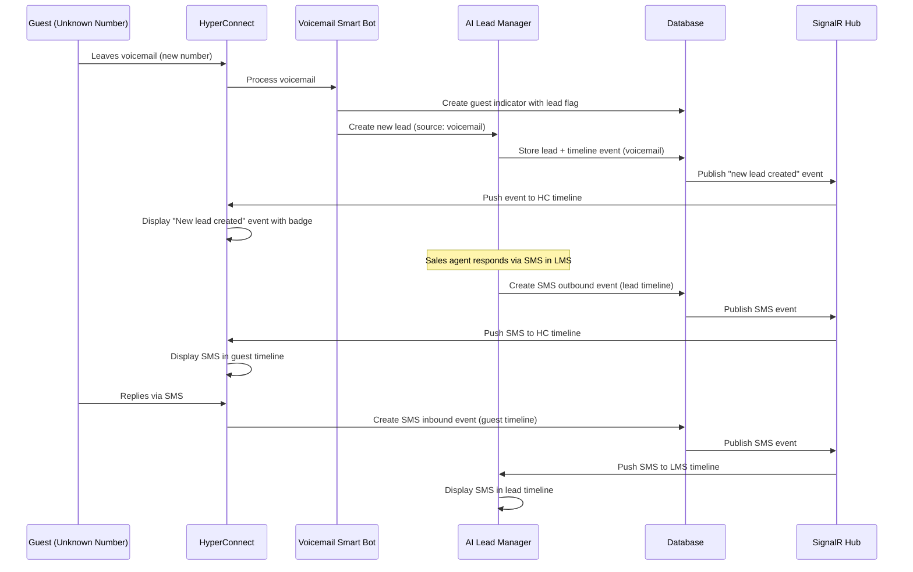
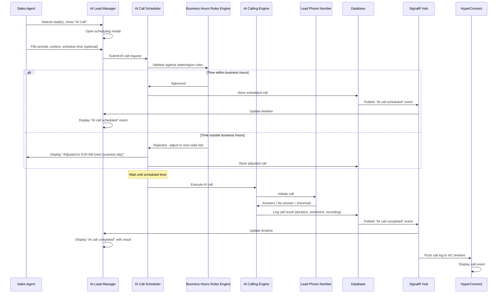

# Requirements Document: AI Lead Manager ↔ HyperConnect Communications Integration

**Version:** 1.0
**Date:** February 12, 2026
**Company:** Zenoti
**Document Owner:** Product & UX Team

---

## 1. Executive Summary

Zenoti is integrating its two flagship products—**HyperConnect** (AI communications concierge) and **AI Lead Manager (LMS)** (lead lifecycle management system)—to provide seamless communication capabilities within the LMS while maintaining conversation continuity across both platforms.

HyperConnect is a mature, stable product used by front desk and sales agents to communicate with guests through calls, voicemail, WhatsApp, SMS, and AI-powered outbound calling. It follows a **person-centric** paradigm where one guest has one consolidated timeline regardless of how many leads exist.

AI Lead Manager is a newer product that captures leads from multiple sources (voicemail smart bot, Facebook campaigns, website forms, manual entry, HyperConnect), manages lead lifecycle, nurtures leads, and converts them to appointments/sales. It follows a **lead-centric** paradigm where each lead has its own distinct timeline.

This integration enables LMS users to perform two-way SMS messaging and voice calling directly from the LMS interface using extracted HyperConnect components (Flutter packages), while preserving conversation continuity between systems. Lead-specific events remain in LMS, while communications (messages, calls) sync bidirectionally to maintain conversation history in HyperConnect.

**Key Goals:**
- Enable communication capabilities in LMS using reusable HyperConnect widgets (voice package, messaging component)
- Maintain UI consistency with HyperConnect patterns
- Preserve distinct value propositions of both products (LMS for lead management, HyperConnect for communications)
- Support multiple concurrent leads per person with expandable tree model
- Provide cross-navigation between systems with lead indicators
- Support HIPAA compliance for MedSpa and healthcare use cases (see **Section 13**)

---

## 2. Glossary

| Term | Definition |
|------|------------|
| **Lead** | A potential sales opportunity captured from various sources (voicemail, Facebook campaign, website form, manual entry). A lead has its own lifecycle, timeline, tasks, notes, and assessment (sales stage, priority). Multiple leads can exist for the same person. |
| **Guest** | An existing customer or contact in Zenoti's system with a profile, purchase history, and consolidated communication timeline. Guests are managed in Zenoti Core and HyperConnect. |
| **HyperConnect (HC)** | AI communications concierge product used by front desk/sales agents for guest communications. Capabilities include inbound/outbound calls, voicemail capture, WhatsApp, SMS, two-way messaging, and outbound AI calling. Person-centric paradigm: one guest = one consolidated timeline. |
| **AI Lead Manager (LMS)** | Lead lifecycle management system that captures, nurtures, and converts leads. Lead-centric paradigm: each lead has its own distinct timeline with tasks, notes, and conversations. |
| **AI Call** | Automated outbound call made by AI agent to follow up with leads or guests. Can be scheduled with specific prompts and context. Governed by state/region-level rules for business hours compliance. |
| **Lead Indicator** | Visual badge/tag in HyperConnect that distinguishes a lead from a regular guest. Removed when lead is converted (closed). Only visible in HyperConnect, not in Zenoti Core. |
| **Timeline** | Chronological view of all events/activities for a person or lead. Includes communications (SMS, calls, voicemails), notes, tasks, appointments, and lifecycle events. |
| **Activity Event** | Individual entry in a timeline (e.g., SMS sent, call made, task created, note added, lead stage changed, appointment booked). |
| **Lead Conversion** | Process of closing/winning a lead when it results in an appointment booking or sale. The lead indicator is removed in HyperConnect and the lead becomes a regular guest profile. |
| **Lead Source** | Origin of a lead: voicemail smart bot, Facebook campaign, website form, manual entry, HyperConnect guest interaction, etc. |
| **Voice Package** | Production-ready Flutter package extracted from HyperConnect that provides plug-and-play voice calling capabilities. Requires environment configuration (organization ID, center ID, SignalR credentials, voice infra URLs). |
| **Messaging Component** | Text/SMS component from HyperConnect timeline that supports two-way messaging and attachments. Currently in POC stage—not yet production-ready as a standalone package like voice widget. |
| **Consolidated View** | In LMS, when selecting a person (phone number) at the top level, shows all activities from all leads associated with that person merged into a single timeline. |
| **Filtered View** | In LMS, when selecting a specific lead under a person, shows only activities specific to that lead. |
| **Expandable Tree Model** | UI pattern in LMS where a person (phone number/name) can be expanded to reveal multiple nested leads beneath, each with its own filtered timeline. |

---

## 3. User Personas

### 3.1 Front Desk Agent (Primary User)
- **Role:** First point of contact for incoming guests and leads
- **Goals:** Quickly respond to inquiries, schedule appointments, provide information
- **Behaviors:** Switches between HyperConnect (for all communications) and LMS (for lead nurturing/tracking)
- **Pain Points:** Context switching between systems, difficulty tracking lead-specific vs. guest-specific conversations
- **Needs:** Unified communication experience, easy cross-navigation, clear lead vs. guest indicators

### 3.2 Sales Manager (Primary User)
- **Role:** Manages lead pipeline, nurtures high-value opportunities, follows up with prospects
- **Goals:** Convert leads to appointments/sales, track lead stages, prioritize outreach
- **Behaviors:** Primarily works in LMS for lead management, uses HyperConnect for guest communications
- **Pain Points:** Losing conversation context when leads convert to guests, managing multiple leads per person
- **Needs:** Lead-centric timeline view, AI calling for bulk outreach, seamless conversation sync

### 3.3 Center Owner (Secondary User)
- **Role:** Oversees center operations, reviews performance metrics, manages staff workflows
- **Goals:** Maximize lead conversion rates, ensure timely follow-ups, maintain service quality
- **Behaviors:** Reviews dashboards, monitors team activities, sets operational policies
- **Pain Points:** Lack of visibility into lead nurturing effectiveness, difficulty understanding lead vs. guest engagement
- **Needs:** Clear separation of lead management and guest communications, compliance with calling regulations

---

## 4. Feature Scope

### 4.1 In Scope for v1
✅ Two-way SMS/messaging from LMS using extracted HyperConnect messaging component
✅ Manual outbound calling from LMS using HyperConnect voice package (Flutter plug-and-play)
✅ AI outbound calling from LMS with scheduling, prompts, and context
✅ Lead indicator badge in HyperConnect to distinguish leads from guests
✅ Conversation sync between LMS and HyperConnect (communications only—no lead-specific events in HC)
✅ Activity timeline in LMS with lead-centric view
✅ Expandable tree model for multiple leads per person in LMS
✅ Consolidated view (person-level) and filtered view (lead-level) in LMS
✅ Cross-navigation: HyperConnect → LMS deep link via "new lead created" event
✅ Cross-navigation: LMS → HyperConnect guest profile via "Linked guest profile" section
✅ Lead conversion flow with lead indicator removal in HyperConnect
✅ UI consistency: messaging and calling components match HyperConnect layout/behavior
✅ Calling action placement in top center section (matching HyperConnect)
✅ AI call dropdown as sub-option under Call action (Manual Call / AI Call)
✅ State/region-level rules for AI calling hours (business hours compliance)
✅ "All events" dropdown filter in LMS timeline
✅ Lead event filtering in timelines

### 4.2 Out of Scope / Future Enhancements
❌ **Dialer in LMS** (Phase 1): Users will select lead and press call button; full dialer remains HyperConnect-only
❌ **WhatsApp as pluggable component**: POC not started; future scope
❌ **AI calling for guests in HyperConnect**: Currently LMS-specific; may come to HC in future for parallel bulk calls
❌ **Overlay navigation pattern**: No precedent exists in platform; v1 uses app-switch/deep-link approach
❌ **Lead-specific events in HyperConnect timeline**: Tasks, notes, lead stage changes stay in LMS; only communications sync to HC
❌ **Messaging component production-ready as standalone package**: POC done, but not seamless plug-and-play like voice package

---

## 5. System Architecture Overview

### 5.1 Component Extraction Model

The integration leverages **HyperConnect components as reusable widgets** extracted into Flutter packages:

#### Voice Package (Production-Ready)
- **Status:** ✅ Ready for integration (plug & play)
- **Technology:** Flutter package
- **Configuration Requirements:**
  ```dart
  class Env {
    static const String organizationId = '';
    static const String centerId = '';
    static const String userId = '';
    static const String signalRToken = '';
    static const String signalRUrl = '';
    static const String webApiToken = '';
    static const String webApiUrl = '';
    static const String voiceBaseUrl = '';
    static const String voiceSocketBaseUrl = '';
    static const String voiceToken = '';
    static const String voiceNumber = '';
    static final DateTime centerDateTime = DateTime(2026, 2, 5, 7, 20, 51);
  }
  ```
- **Registration Parameters:**
  - Core API and voice infra URLs
  - SignalR credentials for real-time communication
  - Organization, center, and user identifiers
  - Feature flags: auto-redirect on accept, contact masking, auto-recording, parking
  - Callbacks: profile opening, telemetry, recording handler, toast messages

#### Messaging Component (POC Stage)
- **Status:** ⚠️ POC completed, not production-ready for seamless plug-and-play
- **Technology:** Flutter component (used for SMS/attachments in HyperConnect timeline)
- **Challenge:** Not developed in a way that can be plugged into other components without significant modifications
- **Next Steps:** Extraction work needed to match voice package's seamless integration model

#### WhatsApp Component (Future)
- **Status:** ❌ Not started
- **Scope:** Future enhancement for multi-channel communication

### 5.2 Backend Dependencies

| Dependency | Description | Status |
|------------|-------------|--------|
| **SignalR** | Real-time messaging infrastructure for live updates (calls, messages) | ✅ Existing |
| **Voice Infra** | Backend services for call routing, recording, parking | ⚠️ Confirmation pending from backend team for LMS context |
| **API Layer** | REST APIs for lead CRUD, timeline events, guest profiles | ✅ Existing |
| **WebSocket** | Voice socket base URL for real-time call signaling | ✅ Existing |
| **Token Provider** | Authentication/authorization for voice and messaging services | ✅ Existing |

### 5.3 Data Model Relationships

```
Guest (Person)
├── Profile (Name, Phone, Email, Purchase History)
├── Timeline (Consolidated: all communications + guest events)
└── Leads (1 to many)
    ├── Lead 1
    │   ├── Lead Details (Score, Sales Stage, Priority, Source, Created Date)
    │   ├── Timeline (Lead-specific: tasks, notes, communications, stage changes)
    │   └── Conversations (SMS, Calls, Voicemails)
    └── Lead 2
        ├── Lead Details
        ├── Timeline
        └── Conversations
```

**Key Relationships:**
- **Guest ↔ Lead(s):** One person can have multiple concurrent leads from different sources
- **Lead ↔ Timeline Events:** Each lead has its own timeline; selecting the person-level shows consolidated view
- **Lead ↔ Conversations:** Communications belong to leads but also sync to HyperConnect guest timeline
- **Guest Indicator + Lead Flag:** Leads stored using guest indicator mechanism with additional lead flag (only HC recognizes)

### 5.4 Timeline Event Synchronization Rules

| Event Type | Visible in LMS | Visible in HyperConnect | Synced Bidirectionally |
|------------|----------------|-------------------------|------------------------|
| SMS Inbound | ✅ Yes | ✅ Yes | ✅ Yes |
| SMS Outbound | ✅ Yes | ✅ Yes | ✅ Yes |
| Call (Manual) | ✅ Yes | ✅ Yes | ✅ Yes |
| Call (AI) | ✅ Yes | ✅ Yes | ✅ Yes |
| Voicemail | ✅ Yes | ✅ Yes | ✅ Yes |
| Task Created | ✅ Yes | ❌ No | ❌ No |
| Note Added | ✅ Yes | ❌ No | ❌ No |
| Lead Stage Change | ✅ Yes | ❌ No | ❌ No |
| Lead Created | ✅ Yes | ✅ Yes (as event marker) | ✅ Yes |
| Lead Converted | ✅ Yes | ✅ Yes (indicator removed) | ✅ Yes |
| Appointment Booked | ✅ Yes | ✅ Yes | ✅ Yes |
| Purchase History | ❌ No (shown in Details panel) | ✅ Yes | N/A |

**Design Principle:** Only **communications** (messages, calls, voicemails) sync to HyperConnect. Lead-specific management events (tasks, notes, stage changes) remain in LMS to preserve the distinct value propositions of both products.

---

## 6. Functional Requirements

### FR1: Lead Creation and Display in LMS

**Description:** Leads are created from various sources and displayed in LMS with expandable tree structure for multiple leads per person.

**User Story:**
_As a sales manager, I want to see all leads organized by person (phone number/name) with the ability to expand and view individual leads, so that I can manage multiple opportunities for the same contact efficiently._

**Acceptance Criteria:**
| # | Criterion | Validated By |
|---|-----------|--------------|
| AC1.1 | Leads display in left panel grouped by person (phone number when no guest profile exists, name when linked) | Visual inspection |
| AC1.2 | Person entry shows expandable indicator when multiple leads exist | Visual inspection |
| AC1.3 | Expanding person reveals nested leads with descriptive labels (e.g., "Membership Lead", "Botox Treatment Lead") | Visual inspection |
| AC1.4 | Each lead shows status badge (e.g., "AI call completed, Positive response", "Follow up call completed", "Won, Lead converted") | Visual inspection |
| AC1.5 | Lead sources are tracked and visible (voicemail, Facebook campaign, website form, manual entry, HC guest) | Data validation |
| AC1.6 | Leads can be created manually from LMS interface | Functional test |

**UI Behavior:**
- Left panel list item structure: `[Person Name/Phone Number] > [Lead 1] [Badge]`
- Collapsed state: Shows person with aggregated lead count indicator (e.g., "2 leads")
- Expanded state: Shows nested leads indented below person
- Selecting person (top-level): Center panel shows consolidated timeline (all lead activities merged)
- Selecting specific lead: Center panel shows filtered timeline (only that lead's activities)

**Edge Cases:**
- ⚠️ **Unknown number with no guest profile:** Display phone number as identifier until guest profile is created/linked
- ⚠️ **Duplicate lead detection:** Deduplication logic must run before displaying multiple leads for same person
- ⚠️ **Lead without phone number:** Edge case for website form leads with email only—requires backend clarification

**Dependencies:**
- Lead CRUD APIs
- Guest profile linking APIs
- Deduplication service

---

### FR2: Two-Way SMS/Messaging from LMS

**Description:** Users can send and receive SMS messages directly from LMS using the extracted HyperConnect messaging component.

**User Story:**
_As a front desk agent, I want to send and receive SMS messages with leads from the LMS interface, so that I can nurture leads without switching to HyperConnect._

**Acceptance Criteria:**
| # | Criterion | Validated By |
|---|-----------|--------------|
| AC2.1 | Messaging component at bottom of center panel looks and behaves exactly like HyperConnect | Visual comparison test |
| AC2.2 | Component includes: Reply/Private note toggle, message type selector (SMS dropdown), message input field, attachments button | Visual inspection |
| AC2.3 | Outbound SMS displays in timeline with outbound indicator and timestamp | Functional test |
| AC2.4 | Inbound SMS displays in timeline with inbound indicator, AI score (if applicable), and timestamp | Functional test |
| AC2.5 | Messages sync bidirectionally—SMS sent from LMS appears in HyperConnect timeline for that person | Integration test |
| AC2.6 | Messages sent from HyperConnect appear in LMS timeline for associated lead | Integration test |
| AC2.7 | Attachment support (images, documents) works consistently with HyperConnect | Functional test |
| AC2.8 | Private notes do NOT sync to HyperConnect (internal-only) | Integration test |

**UI Behavior:**
- Messaging component positioning: Bottom of center panel (Activities section)
- Toggle state: "Reply" (sends to lead) vs. "Private note" (internal only)
- Message type selector: SMS (default), with future support for WhatsApp
- Character count indicator for SMS (if applicable)
- Send button activates when message is non-empty

**Edge Cases:**
- ⚠️ **SMS sending failure:** Display error toast, allow retry, mark message as failed in timeline
- ⚠️ **Person with multiple leads:** Message sent from HyperConnect—which lead timeline should it appear in? (Default: all active leads for that person)
- ⚠️ **Lead converted to guest:** Messages continue to sync to HyperConnect guest profile after conversion

**Dependencies:**
- Messaging component extraction (⚠️ POC stage, not production-ready)
- SMS gateway APIs
- Message sync service between LMS and HC

---

### FR3: Manual Outbound Calling from LMS

**Description:** Users can initiate manual outbound calls to leads directly from LMS using the HyperConnect voice package.

**User Story:**
_As a sales manager, I want to call a lead directly from the LMS interface by clicking the Call button, so that I can have conversations without opening HyperConnect._

**Acceptance Criteria:**
| # | Criterion | Validated By |
|---|-----------|--------------|
| AC3.1 | Call button positioned in top center section of center panel (matching HyperConnect layout) | Visual inspection |
| AC3.2 | Clicking Call initiates outbound call to lead's phone number | Functional test |
| AC3.3 | Call UI overlays display (ringing, connected, duration timer, hold, mute, end) matching HyperConnect | Visual comparison test |
| AC3.4 | Call log entry created in timeline with timestamp, duration, outcome (answered, no answer, busy, failed) | Data validation |
| AC3.5 | Call recordings stored and accessible from timeline (if auto-recording enabled) | Functional test |
| AC3.6 | Voice package configuration uses LMS-specific organization/center/user context | Configuration test |
| AC3.7 | Call syncs to HyperConnect timeline for that person | Integration test |

**UI Behavior:**
- Call button location: Top center of center panel, next to "AI Call" dropdown
- Call button states: Enabled (when lead has phone number), Disabled (when no phone number)
- Call overlay: Full-screen or modal overlay with call controls
- Call controls: Hold, Mute, Keypad, Transfer (if supported), End Call
- Post-call: Prompt for call notes/outcome entry

**Edge Cases:**
- ⚠️ **Lead without phone number:** Call button disabled, tooltip: "No phone number available"
- ⚠️ **Call connection failure:** Display error, allow retry, log failed call attempt in timeline
- ⚠️ **Voice infrastructure not configured:** Show configuration error, prompt admin to complete setup
- ⚠️ **Simultaneous calls:** If user initiates call while another call is active, display warning/queue

**Dependencies:**
- Voice package (✅ production-ready Flutter package)
- Voice infrastructure backend (⚠️ confirmation pending for LMS context)
- SignalR real-time communication
- Call recording service

---

### FR4: AI Outbound Calling from LMS

**Description:** Users can schedule AI-powered outbound calls to leads with custom prompts and context for automated follow-ups.

**User Story:**
_As a sales manager, I want to schedule AI calls to multiple leads for appointment follow-up, so that I can scale outreach without manual dialing._

**Acceptance Criteria:**
| # | Criterion | Validated By |
|---|-----------|--------------|
| AC4.1 | AI Call option available as dropdown under Call button (Manual Call / AI Call) | Visual inspection |
| AC4.2 | Clicking AI Call opens scheduling interface with fields: prompt/script, context, schedule time (optional) | Functional test |
| AC4.3 | Users can select multiple leads from list and bulk-schedule AI calls | Functional test |
| AC4.4 | AI calls are governed by state/region-level rules for business hours (e.g., only 9 AM - 5 PM) | Business logic test |
| AC4.5 | Scheduled AI calls display in timeline as "AI call scheduled" event | Data validation |
| AC4.6 | AI can make parallel calls (e.g., 100 calls at 7:30 AM if all within allowed time window) | Load test |
| AC4.7 | AI call results logged in timeline: answered/not answered, sentiment score, key insights, recording link | Data validation |
| AC4.8 | AI call logs sync to HyperConnect timeline for that person | Integration test |
| AC4.9 | Current supported use case: **appointment follow-up** outbound calls | Business logic test |

**UI Behavior:**
- AI Call button: Dropdown option under Call button
- Scheduling modal fields:
  - **Use Case:** Dropdown (Appointment Follow-Up, [future: Other])
  - **Prompt/Script:** Multi-line text input with template suggestions
  - **Context:** Auto-populated from lead details (name, service of interest, last interaction date)
  - **Schedule Time:** Optional time picker (if empty, AI decides within business hours)
- Bulk selection: Checkbox in left panel to select multiple leads, bulk "Schedule AI Calls" button
- Settings page: Time-window configurations per state/region for AI calling hours

**Edge Cases:**
- ⚠️ **AI call scheduled outside business hours:** System auto-adjusts to next available time slot within rules
- ⚠️ **Lead without phone number:** AI call option disabled
- ⚠️ **AI calling not enabled for organization:** Feature flag check, show upgrade prompt
- ⚠️ **AI call reaches voicemail:** AI leaves message, logs as "Voicemail left"
- ⚠️ **State/region rules change mid-execution:** Scheduled calls re-validate against updated rules before execution

**Dependencies:**
- AI calling engine
- State/region business hours rules engine
- Voice infrastructure backend
- Bulk scheduling APIs
- Settings page for time-window configuration

---

### FR5: Activity Timeline in LMS (Lead-Centric)

**Description:** Each lead has its own distinct timeline in LMS. Selecting a person shows consolidated view; selecting a specific lead shows filtered view.

**User Story:**
_As a sales manager, I want to see all activities for a lead in a dedicated timeline, so that I can track progress and context without noise from other leads._

**Acceptance Criteria:**
| # | Criterion | Validated By |
|---|-----------|--------------|
| AC5.1 | Center panel displays "Activities" timeline with chronological events (newest first) | Visual inspection |
| AC5.2 | Selecting person (top-level in left panel) shows consolidated view: all events from all leads merged | Functional test |
| AC5.3 | Consolidated view example: Task 1 (Lead 1) + SMS (shared) + Task 2 (Lead 2) all visible | Data validation |
| AC5.4 | Selecting specific lead shows filtered view: only events for that lead | Functional test |
| AC5.5 | Filtered view example: Only Task 1 + SMS for Lead 1; Task 2 hidden | Data validation |
| AC5.6 | Timeline events include: SMS (inbound/outbound with AI score), calls (manual/AI), voicemails, tasks, notes, lead stage changes, appointments | Visual inspection |
| AC5.7 | "All events" dropdown filter allows filtering by event type (Messages, Calls, Tasks, Notes, etc.) | Functional test |
| AC5.8 | Each event displays timestamp, type indicator, content preview, and action buttons (view details, edit, delete if applicable) | Visual inspection |

**UI Behavior:**
- Timeline layout: Vertical chronological list with newest events at top
- Event card structure:
  - Icon/indicator (SMS, Call, Task, Note, etc.)
  - Timestamp (relative: "2 hours ago" or absolute: "Feb 5, 2026 3:45 PM")
  - Content preview (first line of message, call duration, task title)
  - Action buttons (context-dependent: Reply, View Recording, Edit Task, etc.)
- Infinite scroll: Load more events as user scrolls down
- Filter dropdown: "All events" (default), "Messages", "Calls", "Tasks", "Notes", "Appointments", "Lead Events"

**Edge Cases:**
- ⚠️ **Empty timeline:** Display placeholder message: "No activities yet. Start a conversation or add a task."
- ⚠️ **Timeline with 1000+ events:** Implement pagination/infinite scroll with performance optimization
- ⚠️ **Event deletion:** Soft delete with option to restore (requires backend support)

**Dependencies:**
- Timeline event APIs (CRUD)
- Filtering/sorting service
- Real-time updates via SignalR

---

### FR6: Lead Indicator Badge in HyperConnect

**Description:** Leads are visually distinguished from regular guests in HyperConnect with a badge/tag. Badge is removed when lead is converted.

**User Story:**
_As a front desk agent, I want to see at a glance which contacts in HyperConnect are active leads, so that I can prioritize my responses and nurturing efforts._

**Acceptance Criteria:**
| # | Criterion | Validated By |
|---|-----------|--------------|
| AC6.1 | Lead entries in HyperConnect left panel display a "Lead" badge next to name/number | Visual inspection |
| AC6.2 | Badge design matches HyperConnect's existing badge pattern (color, size, placement) | Visual comparison test |
| AC6.3 | Badge text: "Lead" or custom label (e.g., "New Lead", "Hot Lead"—TBD in design) | UX review |
| AC6.4 | When lead is converted (closed/won), badge is removed and entry becomes regular guest | Functional test |
| AC6.5 | Lead indicator is **HyperConnect-specific only**—does NOT show in Zenoti Core | Integration test |
| AC6.6 | Backend: Leads stored using guest indicator mechanism with additional lead flag that only HyperConnect recognizes | Backend validation |
| AC6.7 | Multiple leads for same person: Badge shows count (e.g., "2 Leads") | Visual inspection |

**UI Behavior:**
- Badge placement: Right side of person entry in left panel
- Badge styling: Distinct color (e.g., orange/yellow) to differentiate from guest badges (if any)
- Badge states:
  - Single lead: "Lead"
  - Multiple leads: "2 Leads" (clickable to expand tree)
  - Converted: No badge (removed)

**Edge Cases:**
- ⚠️ **Guest becomes lead:** Badge appears dynamically when new lead created for existing guest
- ⚠️ **Partial conversion:** If person has 2 leads and 1 converts, badge changes to "1 Lead"
- ⚠️ **Lead indicator in Zenoti Core:** Must NOT display—requires strict scoping of indicator logic to HyperConnect

**Dependencies:**
- Guest indicator backend system
- Lead flag in database
- HyperConnect UI component updates

---

### FR7: Conversation Sync Between LMS and HyperConnect

**Description:** Communications (SMS, calls, voicemails) sync bidirectionally between LMS and HyperConnect. Lead-specific events (tasks, notes) do NOT sync to HyperConnect.

**User Story:**
_As a user, I want conversations with leads to be visible in both LMS and HyperConnect, so that I have complete communication history regardless of which system I'm using._

**Acceptance Criteria:**
| # | Criterion | Validated By |
|---|-----------|--------------|
| AC7.1 | SMS sent from LMS appears in HyperConnect timeline for that person within 1 second | Real-time sync test |
| AC7.2 | SMS sent from HyperConnect appears in LMS timeline for all active leads for that person within 1 second | Real-time sync test |
| AC7.3 | Call logs (manual and AI) from LMS appear in HyperConnect timeline | Integration test |
| AC7.4 | Call logs from HyperConnect appear in LMS timeline | Integration test |
| AC7.5 | Voicemails captured in HyperConnect appear in LMS timeline | Integration test |
| AC7.6 | **Tasks created in LMS do NOT appear in HyperConnect timeline** | Integration test |
| AC7.7 | **Notes added in LMS do NOT appear in HyperConnect timeline** | Integration test |
| AC7.8 | **Lead stage changes in LMS do NOT appear in HyperConnect timeline** | Integration test |
| AC7.9 | "New lead created" event DOES appear in HyperConnect timeline as event marker (allows navigation to LMS) | Integration test |
| AC7.10 | Conversation continuity preserved: If lead created from HyperConnect voicemail, subsequent LMS conversations show up in HyperConnect | End-to-end test |

**UI Behavior:**
- Real-time sync: SignalR-based push updates, no manual refresh required
- Event attribution: In HyperConnect, synced events show source indicator (e.g., "via LMS" or no indicator)
- Multiple leads scenario: Message from HyperConnect to person with 2 leads—appears in both lead timelines in LMS

**Edge Cases:**
- ⚠️ **Sync failure/delay:** Implement retry mechanism with exponential backoff, show "syncing..." indicator if delay > 5 seconds
- ⚠️ **Message sent from HyperConnect to person with 3 leads:** Which lead timeline(s) should it appear in? (Default: all active leads)
- ⚠️ **Lead converted then message sent:** Message appears in HyperConnect guest timeline, but also in converted lead timeline in LMS

**Dependencies:**
- SignalR real-time messaging infrastructure
- Message sync service (bidirectional event bus)
- Timeline event deduplication logic

---

### FR8: Cross-Navigation (HC ↔ LMS)

**Description:** Users can navigate between HyperConnect and LMS with deep links. From HC, "new lead created" events link to LMS. From LMS, "Linked guest profile" links to HC.

**User Story:**
_As a front desk agent, I want to click on a "new lead created" event in HyperConnect and jump directly to that lead's detail page in LMS, so that I can act on the lead without searching._

**Acceptance Criteria:**
| # | Criterion | Validated By |
|---|-----------|--------------|
| AC8.1 | In HyperConnect timeline, "New lead created" event is clickable with distinct styling (link/button) | Visual inspection |
| AC8.2 | Clicking "New lead created" event in HC opens LMS app/interface with that specific lead pre-selected | Navigation test |
| AC8.3 | Deep link preserves context: Lead ID passed via URL parameter or app navigation API | Technical validation |
| AC8.4 | In LMS right panel, "Linked guest profile" section displays guest name (if linked) with clickable link | Visual inspection |
| AC8.5 | Clicking "Linked guest profile" in LMS opens HyperConnect app/interface with that guest pre-selected | Navigation test |
| AC8.6 | Navigation approach: **App-switch/deep-link** (not overlay, as no overlay precedent exists in platform) | Architecture validation |
| AC8.7 | If target app is not open, system opens it and navigates to correct context | System test |
| AC8.8 | If user lacks permission for target app (LMS or HC), display permission error message | Permission test |

**UI Behavior:**
- HyperConnect:
  - "New lead created" event styling: Blue/underlined text or button with icon
  - Hover state: Tooltip "View in Lead Manager"
- LMS:
  - "Linked guest profile" section in right panel (Details tab)
  - Display format: "Guest Profile: [Name] [Link Icon]"
  - Hover state: Tooltip "View in HyperConnect"
- Navigation transition: Smooth app switch (no jarring context loss)

**Edge Cases:**
- ⚠️ **Lead deleted after event created:** Deep link should show "Lead not found" error page with option to return
- ⚠️ **Guest profile not linked:** "Linked guest profile" section shows "No guest profile linked" with option to link
- ⚠️ **Multiple leads from same event:** If HC event creates multiple leads (edge case), show selection modal in LMS

**Dependencies:**
- Deep linking infrastructure (URL schemes or app navigation APIs)
- Shared authentication/session management
- Permission/role validation across apps

---

### FR9: Lead Conversion Flow

**Description:** When a lead is converted (closed/won), the lead indicator is removed in HyperConnect and the lead becomes a regular guest profile. Timeline history is preserved.

**User Story:**
_As a sales manager, I want to mark a lead as converted when they book an appointment or make a purchase, so that they transition to regular guest status in HyperConnect._

**Acceptance Criteria:**
| # | Criterion | Validated By |
|---|-----------|--------------|
| AC9.1 | In LMS, "Convert Lead" action available in lead details panel (sales stage = "Won" or explicit conversion button) | Visual inspection |
| AC9.2 | Converting lead triggers confirmation dialog: "Mark this lead as converted? This will remove the lead indicator in HyperConnect." | Functional test |
| AC9.3 | After conversion, lead indicator badge in HyperConnect is removed immediately (real-time update) | Integration test |
| AC9.4 | Lead timeline in LMS is preserved and accessible (archived state, not deleted) | Data validation |
| AC9.5 | HyperConnect timeline shows "Lead converted" event at conversion timestamp | Integration test |
| AC9.6 | If person has multiple leads and one converts, badge updates to reflect remaining lead count (e.g., "2 Leads" → "1 Lead") | Functional test |
| AC9.7 | Lead details in LMS change to read-only state after conversion (or moved to "Closed Leads" section) | Functional test |
| AC9.8 | Guest profile in HyperConnect continues to show all communications from before and after conversion | Data continuity test |

**UI Behavior:**
- LMS lead conversion action:
  - Button: "Convert Lead" or dropdown in sales stage: "Mark as Won"
  - Confirmation dialog with context: "This will transition [Name] to a regular guest in HyperConnect."
- Post-conversion state:
  - LMS: Lead status changes to "Converted", greyed out in left panel, timeline archived
  - HyperConnect: Badge removed, entry appears as regular guest
  - Timeline event: "Lead converted on [Date]" added to both LMS and HC timelines

**Edge Cases:**
- ⚠️ **Accidental conversion:** Implement "Undo conversion" option within 5 minutes (soft delete window)
- ⚠️ **Lead converted but appointment canceled:** Lead remains converted; require manual "reopen lead" action if needed
- ⚠️ **Person with 1 lead converts:** Badge completely removed, becomes regular guest
- ⚠️ **Person with multiple leads, all convert:** Badge removed, all leads archived in LMS

**Dependencies:**
- Lead lifecycle state machine
- Real-time badge update via SignalR
- Timeline archival system

---

### FR10: Filtering and Consolidated Views

**Description:** LMS provides multiple view modes: consolidated (person-level) showing all lead activities merged, and filtered (lead-level) showing only specific lead activities. "All events" dropdown enables event type filtering.

**User Story:**
_As a sales manager, I want to toggle between seeing all activities for a person and drilling down into specific lead activities, so that I can understand the full context or focus on one opportunity._

**Acceptance Criteria:**
| # | Criterion | Validated By |
|---|-----------|--------------|
| AC10.1 | Selecting person (top-level) in left panel triggers consolidated view in center timeline | Functional test |
| AC10.2 | Consolidated view displays all events from all leads for that person, chronologically merged | Data validation |
| AC10.3 | Consolidated view example: Task 1 (Lead 1) + SMS + Task 2 (Lead 2) + AI Call (Lead 1) all visible | Visual inspection |
| AC10.4 | Selecting specific lead (nested under person) triggers filtered view in center timeline | Functional test |
| AC10.5 | Filtered view displays only events for that specific lead | Data validation |
| AC10.6 | Filtered view example: Only Task 1 + AI Call for Lead 1; Task 2 hidden | Visual inspection |
| AC10.7 | "All events" dropdown in center panel header allows filtering by event type: All, Messages, Calls, Tasks, Notes, Appointments, Lead Events | Functional test |
| AC10.8 | Event type filter applies to both consolidated and filtered views | Functional test |
| AC10.9 | Filter selection persists across lead selection changes during session | UX test |
| AC10.10 | Visual indicator shows current filter state (e.g., "Showing: Messages only") | Visual inspection |

**UI Behavior:**
- Left panel selection states:
  - Person selected: Highlighted with blue background, timeline shows consolidated view
  - Lead selected: Person remains highlighted, lead shows darker highlight, timeline shows filtered view
- Center panel header:
  - Title: "Activities" (consolidated) or "Activities - [Lead Name]" (filtered)
  - Dropdown: "All events" with options: All, Messages, Calls, Tasks, Notes, Appointments, Lead Events
- Visual feedback:
  - In consolidated view, events show lead attribution label (e.g., "Lead: Membership" next to event)
  - In filtered view, no lead attribution needed (all events belong to selected lead)

**Edge Cases:**
- ⚠️ **Person with 5+ leads:** Consolidated view may have 100+ events—implement performance optimization (pagination, virtualization)
- ⚠️ **Filter "Messages only" + filtered view for lead with no messages:** Show empty state: "No messages for this lead yet"
- ⚠️ **Lead deleted while viewing filtered view:** Redirect to person-level consolidated view with toast: "Lead was deleted"

**Dependencies:**
- Efficient timeline aggregation queries
- Frontend state management for filter persistence
- Event attribution metadata (lead ID on each event)

---

## 7. Non-Functional Requirements

### 7.1 Performance

| Requirement | Target Metric | Validation Method |
|-------------|---------------|-------------------|
| **Real-time message sync** | SMS/call events appear in both systems within 1 second | Load testing with SignalR monitoring |
| **Timeline load time** | Initial timeline render < 1 second for 100 events | Performance profiling |
| **Timeline scroll performance** | Smooth 60 FPS scrolling with infinite scroll for 1000+ events | Frame rate monitoring |
| **Voice package initialization** | Widget ready for calling within 2 seconds of app launch | Instrumentation |
| **Bulk AI call scheduling** | Schedule 100 AI calls in < 5 seconds | Load testing |
| **Cross-navigation deep link** | App switch + context load < 2 seconds | End-to-end timing |

### 7.2 Consistency (UI Parity with HyperConnect)

| Requirement | Description | Validation Method |
|-------------|-------------|-------------------|
| **Messaging component** | Look, feel, and behavior must exactly match HyperConnect | Side-by-side visual comparison test |
| **Calling action layout** | Top center section placement matching HyperConnect pattern | Visual inspection |
| **Timeline event cards** | Consistent styling, icons, and interaction patterns | Visual comparison test |
| **Badge design** | Lead indicator badge matches HyperConnect's badge system | UX review |
| **Responsive behavior** | All components adapt to different screen sizes like HyperConnect | Responsive testing |

### 7.3 Scalability

| Requirement | Description | Validation Method |
|-------------|-------------|-------------------|
| **Multiple leads per person** | Support up to 10 concurrent leads per person without performance degradation | Load testing |
| **Parallel AI calling** | AI engine can execute 100+ simultaneous calls at same time (7:30 AM bulk) | Stress testing |
| **Timeline event volume** | Handle 5000+ events per lead timeline with pagination | Database performance testing |
| **SignalR connections** | Support 1000+ concurrent users with real-time updates | Infrastructure load testing |

### 7.4 Compliance

| Requirement | Description | Validation Method |
|-------------|-------------|-------------------|
| **AI calling hours** | Enforce state/region-level rules for business hours (no calls outside allowed windows) | Business logic testing with various state/region configurations |
| **Call recording consent** | Display consent prompt before recording (if required by jurisdiction) | Compliance review |
| **Contact info masking** | Support contact info masking configuration (PII protection) | Feature flag testing |
| **TCPA compliance** | AI calling adheres to Telephone Consumer Protection Act regulations | Legal review |
| **HIPAA (MedSpa/healthcare)** | When used in healthcare/MedSpa contexts: BAA availability, encryption of PHI in transit and at rest, access controls and MFA for PHI access, audit logging of PHI access/use. See **Section 13** for full requirements and vendor comparisons (Podium, HubSpot, GoHighLevel). | Security audit; legal review; Section 13 checklist |

### 7.5 Reliability

| Requirement | Target Metric | Validation Method |
|-------------|---------------|-------------------|
| **Message delivery** | 99.9% SMS delivery success rate | Monitoring with alerting |
| **Call connection** | 99% call connection success rate (excluding user-side failures) | Call analytics |
| **Sync reliability** | 99.9% event sync success (auto-retry on failure) | Error rate monitoring |
| **Data integrity** | Zero data loss in timeline events or conversations | Audit logging with reconciliation |

### 7.6 Security

| Requirement | Description | Validation Method |
|-------------|-------------|-------------------|
| **Authentication** | All API calls authenticated with valid tokens (webApiToken, signalRToken, voiceToken) | Security audit |
| **Authorization** | Users only access leads/guests in their assigned organization/center | Permission testing |
| **PII protection** | Contact masking enabled per org settings, sensitive data encrypted at rest | Security audit |
| **Audit trail** | All actions (message sent, call made, lead converted) logged with user ID and timestamp | Audit log review |

---

## 8. UI/UX Specifications

### 8.1 LMS 3-Panel Layout

#### Left Panel: Lead List
- **Width:** 320px (fixed)
- **Content:**
  - Search bar at top (search by name, phone, email)
  - Scrollable list of persons/leads
  - Each person entry:
    - Avatar/icon (if available) or phone number initial
    - Name or phone number (bold, 14px)
    - Lead count indicator (if multiple leads): "2 Leads" badge
    - Status badge (e.g., "AI call completed", "Won")
    - Last activity timestamp (gray, 12px)
  - Expandable tree indicator (chevron icon) when multiple leads exist
  - Nested lead entries (indented 24px):
    - Lead label (e.g., "Membership Lead")
    - Status badge
- **Interactions:**
  - Click person: Select, load consolidated timeline in center panel
  - Click chevron: Expand/collapse nested leads
  - Click lead: Select, load filtered timeline in center panel

#### Center Panel: Activities Timeline
- **Width:** Flexible (min 500px)
- **Header:**
  - Title: "Activities" or "Activities - [Lead Name]" (18px bold)
  - "All events" dropdown filter (right-aligned)
  - "Purchase history" button (if guest is linked, right-aligned)
- **Content:**
  - Chronological vertical timeline (newest first)
  - Event cards:
    - Icon (SMS, Call, Task, Note, etc.) - 24px, left-aligned
    - Timestamp (gray, 12px) - top-right
    - Content preview (14px) - truncated to 2 lines
    - Action buttons (Reply, View, Edit) - bottom-right, on hover
  - Infinite scroll: Load more on scroll down
- **Bottom: Messaging Component**
  - Toggle: "Reply" / "Private note"
  - Message type selector: "SMS" dropdown (future: WhatsApp)
  - Input field: Multi-line text input with placeholder "Type your message..."
  - Attachments button (paperclip icon)
  - Send button (primary blue, enabled when text non-empty)

#### Right Panel: Lead Details
- **Width:** 360px (fixed)
- **Header:**
  - Lead score display: "83/150" with progress bar (green/yellow/red)
  - **Call button** (top center, primary blue)
    - Dropdown: "Manual Call" / "AI Call"
  - Tabs: "More info", "Vitals", "Allergies", "Habits", "+15 more" (scrollable horizontal)
- **Content:**
  - **Linked guest profile** section:
    - Label: "Linked guest profile"
    - Value: "[Guest Name]" with link icon (clickable to HC)
    - If not linked: "No guest profile" with "Link profile" button
  - **User details** section:
    - Name (editable field)
    - Phone (editable field with format validation)
    - Email (editable field with validation)
    - Description (multi-line text area)
  - **Lead assessment** section:
    - Sales stage dropdown (New, Contacted, Qualified, Proposal, Won, Lost)
    - Priority dropdown (High, Medium, Low) with color indicators

### 8.2 HyperConnect Changes

#### Left Panel: Guest/Lead List
- **Additions:**
  - **Lead badge** on entries that are active leads
    - Badge text: "Lead" (single) or "2 Leads" (multiple)
    - Badge color: Orange/yellow (distinct from guest badges)
    - Badge placement: Right side of entry, before timestamp
  - **Expandable indicator** (chevron) for persons with multiple leads (future phase)

#### Center Panel: Timeline
- **Additions:**
  - **"New lead created" event card:**
    - Icon: Lead icon (different from message/call icons)
    - Content: "Lead created: [Lead Name/Type]" with timestamp
    - Clickable: Opens LMS with deep link to that lead
    - Styling: Blue text/underline to indicate clickability
  - **"Lead converted" event card:**
    - Icon: Checkmark/trophy icon
    - Content: "Lead converted on [Date]"
    - Non-clickable (informational only)

### 8.3 Calling Action Placement

**LMS:**
- Location: **Top center of center panel** (matching HyperConnect)
- Layout:
  ```
  [Lead Score: 83/150]     [Call ▼]     [Tabs: More info | Vitals | ...]
  ```
- Call button dropdown options:
  - Manual Call (default)
  - AI Call (opens scheduling modal)

**HyperConnect:**
- Location: Already top center (no change)
- Future addition: AI Call dropdown option (Phase 3)

### 8.4 Tree/Expandable Model for Multiple Leads

**Visual Structure:**
```
📞 +1 (407) 555-0123                    [2 Leads]  [Last activity: 2h ago]
  └─ 💼 Membership Lead                 [AI call completed]
  └─ 💉 Botox Treatment Lead            [Follow up call completed]
```

**Interaction States:**
- **Collapsed:** Shows person with lead count badge
- **Expanded:** Shows person + nested leads indented below
- **Person selected:** Consolidated timeline (all lead activities merged)
- **Lead selected:** Filtered timeline (only that lead's activities)

**Visual Indicators:**
- Lead attribution in consolidated view: Tag next to event (e.g., "Lead: Membership")
- Active selection: Blue highlight background

### 8.5 Message Component Parity with HyperConnect

**Critical Parity Elements:**
- Positioning: Bottom of center panel (same as HC)
- Toggle: Reply / Private note (same UI)
- Message type selector: SMS dropdown (same options)
- Input field: Same placeholder text, styling, multi-line behavior
- Attachments: Same button icon and interaction
- Send button: Same color, size, enabled/disabled states
- Character counter: Display if SMS has character limits (same as HC)

**Acceptance Criterion:**
Place LMS and HC messaging components side-by-side—should be **visually indistinguishable** except for context labels.

---

## 9. Data Flow Diagrams

### 9.1 New Lead from Voicemail → LMS → Conversation → HyperConnect Sync



### 9.2 Existing Guest Creates New Opportunity → Lead Creation → Dual Timeline Behavior

```mermaid
sequenceDiagram
    participant Guest as Guest (Existing Profile)
    participant HC as HyperConnect
    participant LMS as AI Lead Manager
    participant DB as Database
    participant SignalR as SignalR Hub

    Note over Guest: Existing guest "Anurag Duke" for 2 years
    Guest->>HC: Inquires about Botox treatment (new opportunity)
    HC->>LMS: Agent creates lead for Anurag (source: HC interaction)
    LMS->>DB: Create lead linked to guest ID + add lead flag
    DB->>SignalR: Publish "new lead created" event
    SignalR->>HC: Push event to HC timeline
    HC->>HC: Add lead badge to Anurag's entry

    Note over HC: HC Timeline: 2-year history + "New lead created" event
    Note over LMS: LMS Timeline: Fresh timeline for Botox lead

    LMS->>DB: Agent adds task "Follow up on Botox pricing"
    Note over HC: Task does NOT sync to HC (lead-specific event)

    LMS->>DB: Agent sends SMS "Here's the Botox pricing info"
    DB->>SignalR: Publish SMS event
    SignalR->>HC: Push SMS to HC timeline
    HC->>HC: Display SMS in Anurag's 2-year timeline

    Note over LMS,HC: Conversation synced; Tasks stay in LMS only
```

### 9.3 AI Call Scheduling → Rule Evaluation → Call Execution → Result Logging



---

## 10. Edge Cases & Open Questions

### 10.1 Edge Cases

| # | Edge Case | Current Handling | Status |
|---|-----------|------------------|--------|
| EC1 | **Guest who is also a lead** | Lead badge appears in HC; Lead details accessible in LMS; Guest profile accessible in HC | ✅ Defined |
| EC2 | **Multiple concurrent leads for same person** | Expandable tree model in LMS; Consolidated timeline in HC; Lead badge shows count | ✅ Defined |
| EC3 | **Lead conversion—what happens to timeline** | LMS: Timeline archived but accessible; HC: "Lead converted" event added, badge removed | ✅ Defined |
| EC4 | **Message from HC to person with 3 leads** | Message appears in all 3 lead timelines in LMS (default behavior) | ⚠️ Defined but may need user testing |
| EC5 | **Lead without phone number** | Call/AI Call buttons disabled; Display tooltip "No phone number available" | ✅ Defined |
| EC6 | **AI call scheduled outside business hours** | System auto-adjusts to next valid time slot within state/region rules | ✅ Defined |
| EC7 | **Voice infrastructure not configured** | Display configuration error; Prompt admin to complete setup | ✅ Defined |
| EC8 | **SMS sending failure** | Display error toast; Allow retry; Mark message as "failed" in timeline | ✅ Defined |
| EC9 | **Sync failure/delay (> 5 seconds)** | Display "syncing..." indicator; Implement retry with exponential backoff | ✅ Defined |
| EC10 | **Lead deleted while viewing filtered view** | Redirect to person-level consolidated view with toast "Lead was deleted" | ✅ Defined |
| EC11 | **Person with 1000+ timeline events** | Implement pagination/infinite scroll with virtualization for performance | ✅ Defined |
| EC12 | **Unknown number with no guest profile** | Display phone number as identifier; Create guest indicator with lead flag | ✅ Defined |
| EC13 | **Duplicate lead detection** | Deduplication logic runs before display; Only genuine distinct leads survive | ⚠️ Requires backend deduplication service |
| EC14 | **Lead converted but appointment canceled** | Lead remains converted; Require manual "reopen lead" action if needed | ⚠️ Needs business logic decision |

### 10.2 Open Questions

| # | Question | Impact | Owner | Status |
|----|----------|--------|-------|--------|
| OQ1 | ⚠️ **AI call for guests (future)—how does it differ from lead AI calls?** | Will determine if AI call UI needs guest vs. lead mode | Product | TBD (Phase 3) |
| OQ2 | ⚠️ **Backend voice infra readiness for LMS context** | Blocks voice calling in LMS if not confirmed | Backend Team (Mohan Vamsi Buddha) | **PENDING CONFIRMATION** |
| OQ3 | ⚠️ **WhatsApp component timeline** | Affects Phase 3 planning | Dev Team | Not started |
| OQ4 | ⚠️ **Messaging component production-readiness timeline** | Affects Phase 1 delivery | Dev Team (Teja) | **NEEDS ESTIMATION** |
| OQ5 | ⚠️ **Lead badge text: "Lead" vs. custom labels** | Affects UX clarity | UX (Adit) | Needs design decision |
| OQ6 | ⚠️ **Deduplication logic for multiple leads** | Critical for data quality | Backend Team | **NEEDS SPEC** |
| OQ7 | ⚠️ **Message attribution for person with multiple leads** | UX decision: Should messages from HC be attributed to specific lead or all leads? | Product + UX | **NEEDS DECISION** |
| OQ8 | ⚠️ **Reopen converted lead action** | Business logic: Should users be able to reopen converted leads? | Product | **NEEDS DECISION** |
| OQ9 | ⚠️ **Settings page for AI calling hours** | Location, permissions, UI design | UX + Dev | **NEEDS DESIGN** |
| OQ10 | ⚠️ **Lead without phone number—source?** | Can website form leads have email only? How to handle? | Product | **NEEDS CLARIFICATION** |

---

## 11. Dependencies & Risks

### 11.1 Component Readiness

| Component | Status | Risk Level | Mitigation |
|-----------|--------|------------|------------|
| **Voice Package** | ✅ Production-ready (Flutter plug-and-play) | 🟢 Low | None—ready for integration |
| **Messaging Component** | ⚠️ POC done, not production-ready | 🟡 Medium | **Priority extraction work needed**; Allocate dev resources (Teja's team); Set target date for production-ready state |
| **WhatsApp Component** | ❌ Not started | 🟢 Low (Phase 3) | Out of scope for v1; Plan for Phase 3 |

### 11.2 Backend Infrastructure

| Dependency | Status | Risk Level | Mitigation |
|------------|--------|------------|------------|
| **Voice Infra for LMS** | ⚠️ Confirmation pending (Mohan Vamsi Buddha's team) | 🔴 High | **CRITICAL:** Schedule immediate meeting with backend team to confirm readiness and identify gaps; Allocate backend dev resources if changes needed |
| **SignalR Real-Time Sync** | ✅ Existing | 🟢 Low | Extend to cover new LMS events |
| **API Layer (Lead CRUD)** | ✅ Existing | 🟢 Low | Minor extensions for new fields (lead flag, source) |
| **Deduplication Service** | ⚠️ Spec not confirmed | 🟡 Medium | Define deduplication logic; Ensure runs before lead creation |

### 11.3 Platform & UX

| Dependency | Status | Risk Level | Mitigation |
|------------|--------|------------|------------|
| **Deep Linking / App Navigation** | ⚠️ Approach confirmed (app-switch), implementation TBD | 🟡 Medium | No overlay pattern exists; Use deep links/URL schemes; Test cross-app navigation thoroughly |
| **Guest Indicator + Lead Flag** | ⚠️ Backend mechanism exists, lead flag logic TBD | 🟡 Medium | Ensure lead flag only recognized by HyperConnect, not Zenoti Core; Test isolation |
| **UI Parity with HyperConnect** | ⚠️ Design specs in progress (Adit) | 🟡 Medium | Conduct side-by-side visual comparison tests; Iterate until indistinguishable |

### 11.4 Compliance & Business Rules

| Dependency | Status | Risk Level | Mitigation |
|------------|--------|------------|------------|
| **State/Region AI Calling Rules** | ⚠️ Rules exist, integration in settings page TBD | 🟡 Medium | Design settings page UI; Implement rule validation in scheduler; Test with multiple states/regions |
| **TCPA Compliance** | ⚠️ AI calling adherence needs legal review | 🟡 Medium | Engage legal team early; Ensure consent mechanisms in place |

### 11.5 Performance & Scalability

| Risk | Description | Likelihood | Impact | Mitigation |
|------|-------------|------------|--------|------------|
| **Timeline performance with 1000+ events** | Slow rendering/scrolling | 🟡 Medium | 🔴 High | Implement pagination, virtualization, lazy loading |
| **Real-time sync delays** | SignalR latency > 5 seconds | 🟢 Low | 🟡 Medium | Load test SignalR; Implement retry + "syncing..." indicator |
| **Parallel AI calls overload** | 100+ simultaneous calls crash voice infra | 🟡 Medium | 🔴 High | Load test AI calling engine; Implement rate limiting/queuing |
| **Multiple leads per person complexity** | Tree model UX confusing for users | 🟡 Medium | 🟡 Medium | Conduct user testing; Iterate on tree/expandable design |

### 11.6 Overall Risk Assessment

| Risk Category | Overall Level | Key Concerns |
|---------------|---------------|--------------|
| **Technical Delivery** | 🟡 Medium | Messaging component not production-ready; Voice infra confirmation pending |
| **UX Complexity** | 🟡 Medium | Tree model for multiple leads; UI parity with HC |
| **Backend Readiness** | 🔴 High | **Voice infra confirmation critical blocker** |
| **Timeline** | 🟡 Medium | Messaging component extraction timeline unclear |

---

## 12. Release Plan

### Phase 1: Core Communication & Sync (Recommended MVP)
**Target:** Q1 2026 (8-10 weeks)
**Goal:** Enable basic communication capabilities in LMS with HyperConnect conversation sync

**Features:**
- ✅ Voice calling from LMS (manual outbound calls) using voice package
- ✅ Two-way SMS messaging from LMS (using messaging component—**requires production-readiness work**)
- ✅ Lead indicator badge in HyperConnect
- ✅ Conversation sync (SMS, calls, voicemails) between LMS and HyperConnect
- ✅ Basic timeline view in LMS (single lead, no tree model yet)
- ✅ "New lead created" event in HC with deep link to LMS
- ✅ "Linked guest profile" in LMS with link to HC
- ✅ UI consistency: Messaging and calling components match HyperConnect layout

**Dependencies to Resolve:**
- 🔴 **Voice infra backend confirmation** (Mohan Vamsi Buddha's team)
- 🟡 **Messaging component extraction to production-ready state** (Teja's team)

**Success Criteria:**
- Users can call and message leads from LMS without opening HyperConnect
- Conversations visible in both systems within 1 second
- Lead indicator visible in HyperConnect

---

### Phase 2: AI Calling & Advanced Navigation (Feature Enhancement)
**Target:** Q2 2026 (6-8 weeks)
**Goal:** Add AI calling capabilities and support multiple leads per person

**Features:**
- ✅ AI outbound calling from LMS with scheduling, prompts, and context
- ✅ AI call dropdown as sub-option under Call action (Manual Call / AI Call)
- ✅ State/region-level rules for AI calling hours (business hours compliance)
- ✅ Settings page for time-window configurations per region
- ✅ Expandable tree model for multiple leads per person in LMS
- ✅ Consolidated view (person-level) and filtered view (lead-level) in LMS
- ✅ Lead conversion flow with indicator removal in HyperConnect
- ✅ "All events" dropdown filter in timelines

**Dependencies:**
- AI calling engine integration
- Business hours rules engine
- Enhanced UI for tree/expandable model

**Success Criteria:**
- Users can schedule AI calls for bulk outreach (e.g., 100 leads at once)
- Tree model allows managing multiple leads per person without confusion
- Filtering works seamlessly for consolidated and filtered views

---

### Phase 3: Multi-Channel & Guest AI Calling (Future Expansion)
**Target:** Q3 2026 (TBD)
**Goal:** Expand communication channels and bring AI calling to HyperConnect guests

**Features:**
- ✅ WhatsApp integration as pluggable component in LMS
- ✅ AI calling for guests in HyperConnect (parallel bulk calls for appointment follow-ups)
- ✅ Dialer in LMS (if needed based on user feedback)
- ✅ Advanced filtering and analytics (lead source attribution, conversion metrics)
- ✅ Overlay navigation (if precedent is established in platform)

**Dependencies:**
- WhatsApp component development
- AI calling engine extension for guest context
- Platform-wide overlay pattern (if approved)

**Success Criteria:**
- Multi-channel communication (SMS, WhatsApp, calls) seamless in LMS
- AI calling available for both leads and guests with same UX
- Analytics show clear lead conversion attribution

---

## 13. HIPAA Compliance for Integrations and Communications

When LMS and HyperConnect are used in **MedSpa, wellness, or healthcare contexts**, conversations and integrations may involve **Protected Health Information (PHI)**. This section outlines how to make these integrations and communications HIPAA compliant, what controls to implement, and how comparable products (Podium, HubSpot, GoHighLevel) address HIPAA for MedSpa scenarios.

### 13.1 How to Make Integrations and Communications HIPAA Compliant

**Core requirements for HIPAA-compliant integrations and communications:**

| Requirement | Description | Application to LMS ↔ HC |
|-------------|-------------|---------------------------|
| **Business Associate Agreement (BAA)** | Any vendor that creates, receives, maintains, or transmits PHI on behalf of a covered entity must sign a BAA. | Zenoti (and any sub-processors for voice, SMS, storage) must offer and sign BAAs with covered entities (e.g., MedSpas that are HIPAA-covered). |
| **Encryption in transit and at rest** | PHI must be protected with encryption (e.g., TLS in transit, AES-256 at rest). | All APIs (REST, SignalR, voice WebSocket), message sync pipelines, and stored timeline/communication data must use encryption. |
| **Access controls** | Only authorized users may access PHI. Role-based access and authentication (e.g., MFA) are expected. | LMS and HyperConnect must enforce org/center/user permissions; consider MFA for users with access to PHI. |
| **Audit logging** | Access to and use of PHI must be logged (who, what, when). | Log all actions that touch PHI: message send/receive, call logs, timeline views, lead/guest profile access, exports. |
| **Minimum necessary** | Use and disclosure of PHI should be limited to the minimum necessary for the purpose. | Sync only what is needed between LMS and HC; avoid exposing full PHI to systems or roles that don’t need it. |
| **Breach notification** | Procedures for detecting and reporting breaches of unsecured PHI. | Define incident response and breach notification procedures for communication and integration systems. |

**SMS and voice specifics:**

- **SMS:** Standard SMS is not inherently secure. HIPAA-compliant SMS typically requires: (1) BAA with the messaging/SMS provider, (2) encryption in transit and at rest where possible, (3) access controls and audit trails, (4) policies to minimize PHI in message content when avoidable.
- **Voice:** Call recordings and any transcripts that contain PHI are PHI. Require: (1) BAA with voice/carrier provider, (2) encrypted storage and transmission, (3) consent/notification where required by state or policy, (4) access controls and audit logs for recordings.

### 13.2 What We Can Do to Ensure HIPAA Compliance

| Action | Description |
|--------|-------------|
| **Execute BAAs** | Sign BAAs with all vendors that process PHI (voice infra, SMS gateway, cloud storage, analytics if they touch PHI). Ensure sub-processors are also bound (e.g., via BAA or DPA). |
| **Encrypt end-to-end** | Use TLS for all API and real-time (SignalR, WebSocket) traffic; encrypt PHI at rest (e.g., AES-256) for timelines, messages, call recordings, and attachments. |
| **Enforce access control and MFA** | Restrict access to LMS and HyperConnect by org/center/role; require MFA for users who can view or send PHI. |
| **Implement audit trails** | Log access and actions on PHI (message sent/received, call made, recording accessed, lead/guest viewed). Retain logs per HIPAA retention expectations. |
| **Contact masking / minimum necessary** | Use existing “contact info masking” and similar features to limit PHI exposure on screens and in exports. Only sync and display data necessary for the task. |
| **Policies and training** | Maintain HIPAA policies (privacy, security, breach notification) and train staff on handling PHI in LMS and HyperConnect. |
| **Risk analysis and remediation** | Perform periodic risk analysis (e.g., per Security Rule) and address gaps (e.g., encryption, access control, vendor BAAs). |
| **Call recording consent** | Where required by law or policy, obtain consent before recording and document it; support “no recording” or redaction where appropriate. |

### 13.3 How Podium, HubSpot, and GoHighLevel Make Conversations HIPAA Compliant (MedSpa Scenarios)

**Podium**

- **HIPAA status:** Podium is HIPAA compliant and has achieved a HIPAA Seal of Compliance (e.g., via Compliancy Group), covering Privacy Rule, Security Rule, Breach Notification, and HITECH.
- **BAA:** Podium signs BAAs with covered entities and business associates.
- **MedSpa use:** Used by 100,000+ businesses including healthcare and MedSpas for patient messaging, bulk texting, reviews, NPS, and payments. Their healthcare messaging platform is positioned for practices and MedSpas that need to keep PHI in compliant channels.
- **Takeaway:** For Zenoti, ensure BAA coverage for any messaging channel (SMS, etc.) used for PHI and align with similar compliance certifications and controls (encryption, access control, audit).

**HubSpot**

- **HIPAA status:** HubSpot offers HIPAA compliance for **specific covered services** on **enterprise** subscriptions. A super-admin must enable “HIPAA-protected sensitive data” settings; HubSpot then enters into a BAA with the customer.
- **Covered services:** Include CRM attachments, forms, workflows, CRM objects API, activities (e.g., call logs—but not necessarily call recordings/transcripts with PHI), integrations, search, list creation, and limited reporting. Reporting Analytics, Custom Report Builder, and certain data sets are **not** in scope.
- **Limitations:** Only enterprise plans qualify; all integrated apps must also be HIPAA compliant; configuration can be complex.
- **Takeaway:** For LMS/HC, consider a similar model: explicit “HIPAA mode” or BAA-backed scope, clear list of in-scope features (e.g., messaging, call logs, timeline), and documentation of out-of-scope features (e.g., some analytics or third-party integrations).

**GoHighLevel**

- **HIPAA status:** GoHighLevel is HIPAA compliant as a company, but **standard accounts are not HIPAA compliant by default**. Compliance is enabled via an optional **HIPAA add-on** (~$297/month, account-wide, typically activated in 48–72 hours).
- **Features with add-on:** BAA signed in-app; encryption of ePHI (e.g., AES-256 with key rotation); audit logging and user activity logs; MFA enforcement; role-based access control.
- **MedSpa use:** Used for MedSpas and health businesses for secure client communication, scheduling, reminders, and lead management when the HIPAA module is enabled.
- **Takeaway:** For Zenoti, consider an optional HIPAA tier or add-on that turns on BAA, encryption guarantees, audit logging, MFA, and RBAC for centers that need it (e.g., MedSpas), while keeping default product usable for non-covered entities.

### 13.4 Recommendations for LMS ↔ HyperConnect (MedSpa / Healthcare)

| Recommendation | Priority |
|----------------|----------|
| **Define “HIPAA-ready” scope** | Define which features and data flows are in scope for BAA (e.g., SMS, voice, timeline sync, call recordings, attachments). Document what is out of scope (e.g., certain analytics or third-party integrations). |
| **Offer BAA and HIPAA documentation** | For MedSpa/healthcare centers, offer a signed BAA and document encryption, access control, and audit logging in place. |
| **Optional HIPAA tier or add-on** | Consider a paid HIPAA add-on (similar to GoHighLevel) that enables BAA, enhanced audit logs, MFA enforcement, and explicit encryption commitments for ePHI. |
| **Vendor BAAs** | Ensure voice infrastructure, SMS gateway, and any storage/processing vendors used for PHI are under BAAs. |
| **Extend NFR compliance table** | Add HIPAA-related rows to the Compliance section (e.g., BAA availability, encryption at rest/transit, audit logging, MFA for PHI access) with validation method (e.g., security audit, legal review). |

---

## Appendix A: HyperConnect Component Integration Details

### Voice Package Registration Example

```dart
voice_package.register(
  coreApiBaseUrl: Env.webApiUrl,
  apiBaseUrl: Env.voiceBaseUrl,
  apiToken: Env.webApiToken,
  signalRBaseUrl: Env.signalRUrl,
  signalRToken: Env.signalRToken,
  voiceSocketBaseUrl: Env.voiceSocketBaseUrl,
  tokenProviderBaseUrl: Env.voiceToken,
  organizationId: Env.organizationId,
  centerId: Env.centerId,
  centerDateTime: Env.centerDateTime,
  holderId: Env.userId,
  isCallCenter: false,
  agentId: Env.userId,
  agentName: 'Lead Management Agent',
  phoneNumber: Env.voiceNumber,
  shouldAutoRedirectOnAccept: true,
  isContactInfoMaskingEnabled: false,
  openProfileCallback: (_, __, ___, ____, _____) {},
  pushTelemetryCallback: (
    String event, {
    Map<String, dynamic>? properties,
  }) {},
  shouldAutoRedirectOnDummyPopupShown: false,
  isAutoRecordOutgoingCallEnabled: false,
  allowParking: false,
  parkTimeoutSeconds: 0,
  recordingHandler: (_) {
    return Future.value(true);
  },
  toastMessageHandler: (_, __) {},
);
```

### Messaging Component Integration Status

**Current State (from team discussion):**
> "But coming to the text field (component used to send messages & attachments) that is present in the HyperConnect timeline will be somewhat challenging because its not developed in a way that can be plugged into any other component without making changes."
> — Teja Simha Samba

> "Yes we are looking forward to extract the text field too as a package, in the POC video i shared above its already extracted. But I am being honest that its not in the same production ready state as voice package to plug seamlessly."
> — Teja Simha Samba

**Next Steps:**
- Allocate engineering resources to refactor messaging component for plug-and-play use
- Define interface contract similar to voice package (registration, callbacks, configuration)
- Test extraction in isolated environment before LMS integration

---

## Appendix B: Timeline Event Sync Rules (Detailed)

| Event Type | LMS Create | LMS Display | HC Display | Sync Direction | Notes |
|------------|------------|-------------|------------|----------------|-------|
| **SMS Inbound** | Auto (from SMS gateway) | ✅ All lead timelines for person | ✅ Person timeline | Bidirectional | Appears in all active leads for person in LMS |
| **SMS Outbound** | User action in LMS or HC | ✅ Lead timeline | ✅ Person timeline | Bidirectional | |
| **Call Manual** | User action in LMS or HC | ✅ Lead timeline | ✅ Person timeline | Bidirectional | Includes duration, outcome |
| **Call AI** | Scheduled in LMS | ✅ Lead timeline | ✅ Person timeline | Bidirectional | Includes sentiment, recording |
| **Voicemail** | Auto (from voicemail bot) | ✅ Lead timeline | ✅ Person timeline | Bidirectional | May trigger lead creation |
| **Task** | User action in LMS | ✅ Lead timeline | ❌ Not displayed | None | Lead-specific management event |
| **Note** | User action in LMS | ✅ Lead timeline | ❌ Not displayed | None | Lead-specific management event |
| **Private Note** | User action in LMS | ✅ Lead timeline (marked private) | ❌ Not displayed | None | Internal-only, no sync |
| **Lead Stage Change** | Auto or user action | ✅ Lead timeline | ❌ Not displayed | None | Lead-specific management event |
| **New Lead Created** | Various sources | ✅ Lead timeline | ✅ Person timeline (event marker) | HC only | Allows navigation to LMS |
| **Lead Converted** | User action in LMS | ✅ Lead timeline | ✅ Person timeline (event marker) | Bidirectional | Triggers badge removal in HC |
| **Appointment Booked** | User action in LMS or Core | ✅ Lead timeline | ✅ Person timeline | Bidirectional | Guest event, visible in both |

---

## Appendix C: Glossary of Acronyms

| Acronym | Full Form |
|---------|-----------|
| **LMS** | Lead Management System (AI Lead Manager) |
| **HC** | HyperConnect |
| **AI** | Artificial Intelligence |
| **SMS** | Short Message Service |
| **API** | Application Programming Interface |
| **CRUD** | Create, Read, Update, Delete |
| **POC** | Proof of Concept |
| **UX** | User Experience |
| **UI** | User Interface |
| **PII** | Personally Identifiable Information |
| **TCPA** | Telephone Consumer Protection Act |
| **SignalR** | Microsoft's real-time communication library |
| **FR** | Functional Requirement |
| **NFR** | Non-Functional Requirement |
| **AC** | Acceptance Criteria |

---

**Document End**

---

## Document Control

| Version | Date | Author | Changes |
|---------|------|--------|---------|
| 1.0 | 2026-02-12 | Product & UX Team | Initial requirements document based on team discussion transcript and HyperConnect integration context |

**Approval Sign-Off:**

| Role | Name | Signature | Date |
|------|------|-----------|------|
| Product Manager | Balakrishna Narayanan | | |
| UX Lead | Adit Kohli | | |
| Dev Lead | Anurag Chaudhary | | |
| Backend Lead | Mohan Vamsi Buddha | | |
| Frontend Lead | Teja Simha Samba | | |

---

**Next Steps:**
1. ✅ Review and approve requirements document (all stakeholders)
2. 🔴 **URGENT:** Confirm voice infrastructure backend readiness (Mohan Vamsi Buddha)
3. 🟡 Estimate messaging component extraction timeline (Teja)
4. 🟡 Resolve open questions (OQ1-OQ10)
5. ✅ Prioritize Phase 1 features for engineering kickoff
6. ✅ Schedule design review for UI parity and tree model (Adit)
